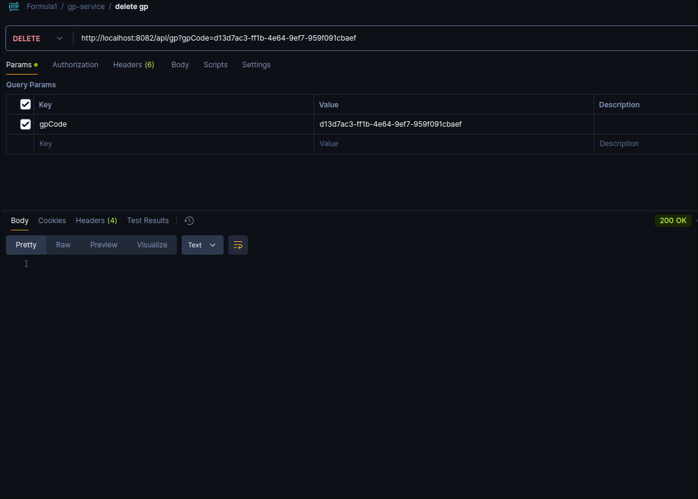

# Formula 1 Microservices

- Documentatie:

  - Beschrijving van het gekozen thema, je microservices en andere componenten zoals gateways in lijst en schema, en je uitbreidingen + link naar de zaken die hosted zijn op GitHub README.md
  - Aantoonbare werking van alle endpoints door screenshots van Postman requests op GitHub README.md

## Thema

Ik heb gekozen om een microservices project te maken rond Formule 1. Hiervoor
heb ik 3 services gemaakt. De eerste service bevat **'Drivers'** (chauffeurs),
de tweede bevat **Teams** en de laatste **Grand Prix**. Ik heb voor deze
entiteiten gekozen, omdat er hiervoor wel wat interactie nodig is tussen de
verschillende services (team heeft drivers nodig, GP (Grand Prix) heeft zowel
teams en drivers nodig, etc.), wat het interessant en leerrijk maakte voor dit
project.

Bepaalde endpoints van deze services kunnen bereikt worden via de
**gateway-service**. Deze gateway bevat ook een implementatie van OAuth2 met
Google Account.

Ik wou ook voor elke service wat foto's opslaan (om een mooiere frontend te
maken), maar ik besefte dat het in een microservices-applicatie niet echt het
plan is om in elke service foto's op te slaan. In de realiteit zal er een
andere centrale service (zoals _S3-buckets_) gebruikt worden om media in op te
slaan, maar aangezien ik hier geen toegang tot had heb ik besloten om dit
gedrag wel te centraliseren in een service: de **image-service**. In deze
service staan alle foto's opgeslagen.

Zoals hierboven al kort vermeld heb ik ook **frontend** gemaakt. Deze heb ik
gemaakt met `React`. Op deze frontend worden heel wat gegevens uit de
services weergegeven. Iemand die inlogt (en in de lijst van toegestane
e-mailadressen staat) kan Grand Prix aanmaken, wijzigen en verwijderen. Om dit
klaar te krijgen was ook Google OAuth2-login nodig op de frontend. De frontend
stuurt enkel requests naar de gateway-service, die ze dan doorstuurt naar de
juiste service.

Alle services kunnen zeer makkelijk gedeployed worden, door middel van
`docker`. Er is een `docker-compose`-bestand (`docker-compose.yaml`) dat alle services samen
opstart.

Als laatste heb ik `Prometheus` en `Grafana` toegevoegd aan de stack. Deze
applicaties worden via docker mee met al de rest gedeployed. Beiden zijn nuttig
om data te visualiseren, maar omdat ik niet blij was met de beschikbare data in
Prometheus heb ik nog een extra docker-applicatie toegevoegd:`node_exporter`. ``node_exporter` verzamelt data over het
host-systeem.

Naast docker heb ik ook alles geconfigureerd om te werken met `kubernetes`. Dit
betekent dat alle services, inclusief monitoring en ingress met kubernetes
gedeployed kunnen worden. Op mijn computer kon ik het enkel testen met
`minikube`, maar het zou in theorie op eender welke `kubernetes`-cluster moeten
werken.

Als laatste heb ik op de `api-gateway` ook **rate-limiting** geïmplementeerd.

## Componenten en informatie

Services:

- Driver service
  - Port: 8081
  - Database `mysql`
  - `DriverService`-klasse volledig getest
- Grand Prix service
  - Port: 8082
  - Database `mysql`
  - `GpService`-klasse volledig getest
- Team service
  - Port: 8080
  - Database `mongodb`
  - `TeamService`-klasse volledig getest
- Gateway
  - Port: 8083
- Image service
  - Port: 8084

Extra:

- `docker-compose`
- `Kubernetes`
- `Prometheus` monitoring (met node_exporter voor extra data)
- `Grafana` visualisatie
- api-gateway rate-limiting
- `Frontend (React)`
  - Port: 5173 (`npm run dev`)

## Postman requests

Hieronder zie je de API in werking via HTTP-aanvragen die ik via Postman uitgevoerd heb.

### Driver service

All drivers:

Add driver:

Update driver:

Get driver by code:

### Team service

All teams:

Add team:

Get team by code:

### Grand Prix service

All Grand Prix:

Add Grand Prix:

Update Grand Prix:

Get Grand Prix by code:

Delete Grand Prix by code

en na het verwijderen returned de API-call een 404 http-code.

### Image service

Image uploaden:

Image openen:

